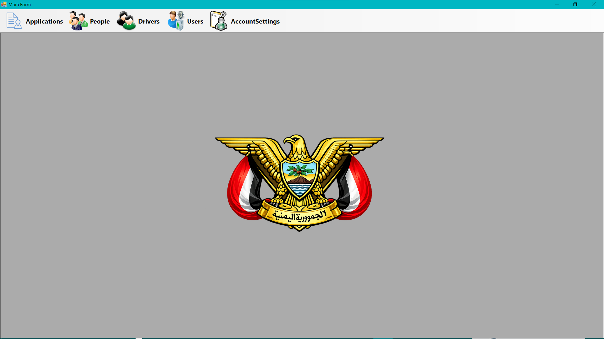
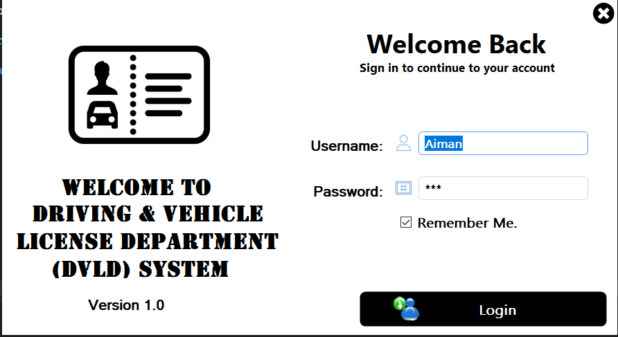
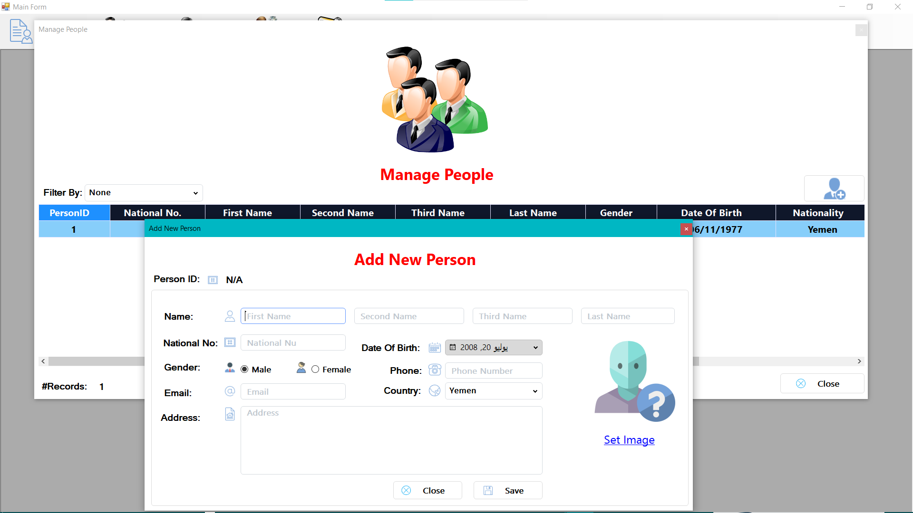
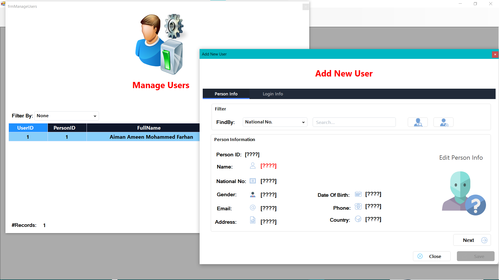
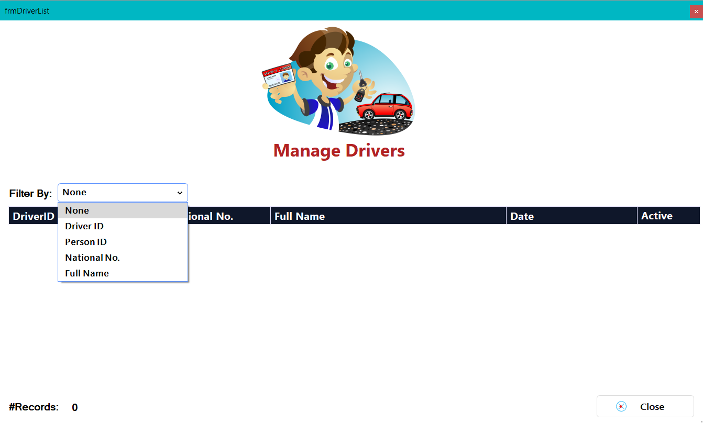
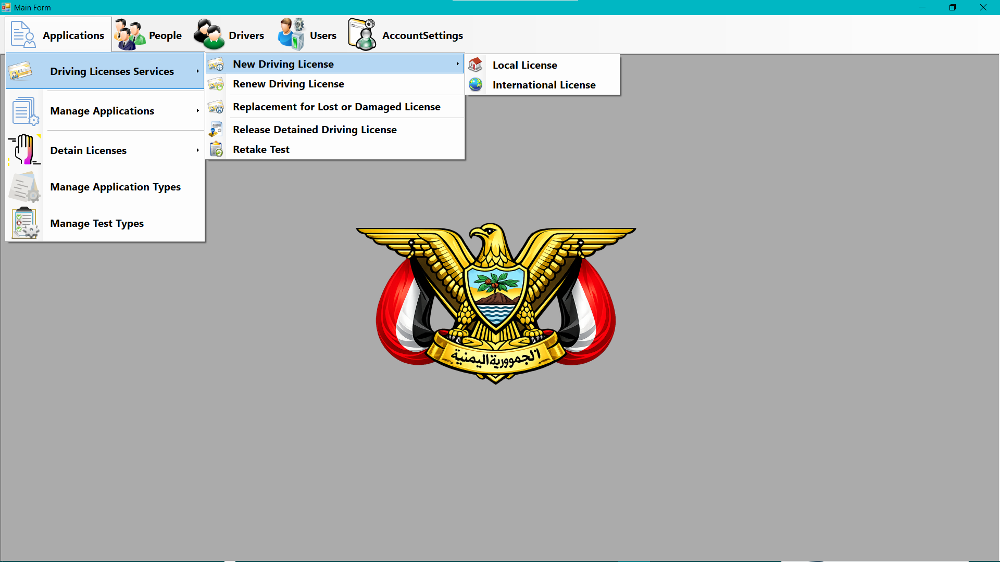
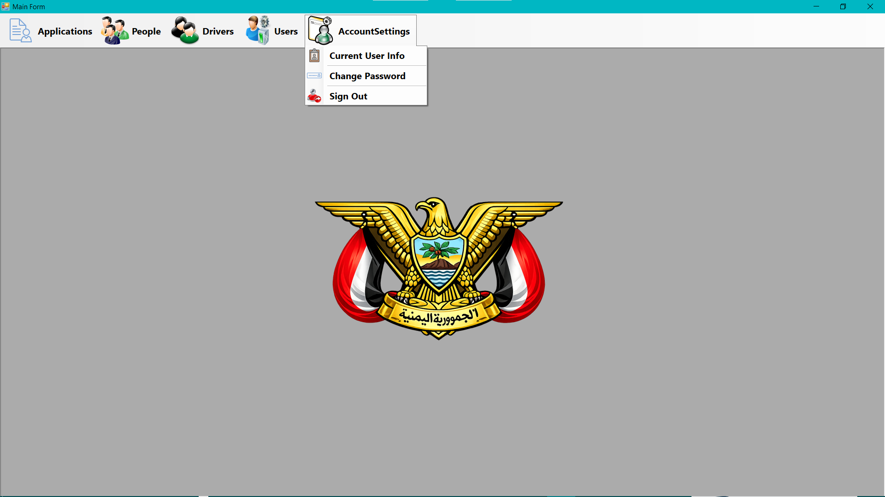

# 🚗 DVLD — Driving & Vehicle License Department

<p align="center">

  

</p>

<h3 align="center">
  Driving & Vehicle License Department Management System
</h3>

<p align="center">
  A complete desktop application for managing people, users, applications, tests, drivers, and driving licenses.
</p>

<p align="center">


</p>

---

## 📌 Overview

**DVLD (Driving & Vehicle License Department)** is a comprehensive desktop application developed using **C# and Windows Forms** to simulate a real-world Driving & Vehicle License Department.

The project focuses not only on implementing features, but also on understanding how to analyze a real system, design its database, organize the application into separate layers, and connect all components together to build a maintainable and scalable software solution.

The system covers multiple workflows related to:

- 👤 People Management
- 🔐 User Management
- 📝 Applications
- 🧪 Tests
- 🚗 Drivers
- 🪪 Driving Licenses
- 🌍 International Licenses
- ⚠️ License Detention
- 🔄 License Renewal & Replacement
- ⚙️ Account Management

> 🚀 **This project is part of my learning journey through Programming Advices and was developed as a practical application of the concepts learned throughout Course 19.**

---

# ✨ Key Features

## 👤 People Management

Manage and maintain information about people registered in the system.

### Features

- ➕ Add new people
- 📋 View people
- ✏️ Update personal information
- 🔎 Search and filter people
- 🗑️ Manage person records
- 🧩 Reusable person-related components

---

## 👥 User Management

Complete management of system users and their accounts.

### Features

- ➕ Add new users
- 📋 View users
- ✏️ Update user information
- 🔐 Manage user credentials
- ✅ Activate users
- ⛔ Deactivate users
- 👤 Link users with people
- 🔑 Control access to system functionality

---

## 📝 Applications Management

The system supports different types of applications and manages their complete lifecycle.

### Includes

- 📋 Manage Application Types
- 📝 Create applications
- 🔎 View application information
- 🔄 Manage application status
- 👤 Link applications with people
- 💳 Manage application fees
- 📅 Manage application-related workflows

---

## 🧪 Tests Management

The system provides functionality for managing different driving-related tests.

### Includes

- 🧪 Manage Test Types
- 📋 Schedule tests
- 📅 Manage test appointments
- 🔎 View test information
- 📊 Track test results
- 🔄 Manage test-related application workflows

---

## 🚗 Local Driving License

The system supports the complete workflow for issuing local driving licenses.

### Workflow

```text
Person
   ↓
Application
   ↓
Test Scheduling
   ↓
Tests
   ↓
Application Completion
   ↓
Driver
   ↓
Driving License

The system connects the different stages together to simulate a real licensing process.

🚘 Drivers Management

The system provides functionality for managing registered drivers.

Features
👤 View drivers
🔎 Search drivers
📋 Display driver information
🪪 View driver's licenses
🌍 Manage international licenses
🔗 Connect drivers with their related people and licenses
🪪 Driving Licenses

The system supports multiple license operations.

Supported Operations
🆕 Issue License
🔄 Renew License
♻️ Replace Lost License
🛠️ Replace Damaged License
🔎 View License Information
📋 Manage License Records
🌍 International Driving License

The system also supports international driving licenses.

Features
🌍 Issue International License
🔎 View International License
📋 Manage International Licenses
👤 Link international licenses with drivers
📅 Manage license validity
⚠️ License Detention

The project includes a complete workflow for handling detained licenses.

Features
🔒 Detain License
📋 Manage Detained Licenses
🔎 Search detained licenses
🔓 Release License
📝 Record detention information
💰 Manage applicable fees
🔄 License Renewal & Replacement

The system supports different license lifecycle operations.

Renewal
🔎 Find existing license
📅 Validate license status
🔄 Renew license
💰 Calculate applicable fees
📝 Create renewal records
Replacement
🛠️ Replace damaged license
🚨 Replace lost license
📝 Record replacement information
💰 Manage replacement fees
🏗️ Architecture

The application follows a Three-Tier Architecture to separate responsibilities, improve maintainability, and keep the code organized.

┌─────────────────────────────────────────┐
│         🖥️ Presentation Layer           │
│              Windows Forms              │
│                                         │
│        User Interface & Interaction     │
└────────────────────┬────────────────────┘
                     │
                     ▼
┌─────────────────────────────────────────┐
│           ⚙️ Business Layer             │
│                                         │
│        Business Rules & Logic           │
└────────────────────┬────────────────────┘
                     │
                     ▼
┌─────────────────────────────────────────┐
│        🗄️ Data Access Layer             │
│                                         │
│              ADO.NET                    │
│       Database Communication             │
└────────────────────┬────────────────────┘
                     │
                     ▼
┌─────────────────────────────────────────┐
│             💾 SQL Server               │
│                                         │
│              DVLD Database               │
└─────────────────────────────────────────┘
🔹 Presentation Layer

Responsible for:

User Interface
Windows Forms
User interaction
Input validation
Displaying information
Calling the Business Layer
🔹 Business Layer

Responsible for:

Business rules
Application logic
Validation
Processing operations
Connecting the Presentation Layer with the Data Access Layer
🔹 Data Access Layer

Responsible for:

Database communication
CRUD operations
Executing SQL commands
Retrieving data
Updating database records
Using ADO.NET
🔹 Database

SQL Server is used to store and manage the application's data.

🗂️ Project Structure
DVLD-Project
│
├── 📁 DVLDDataAccessLayer
│   └── Database access and ADO.NET operations
│
├── 📁 DVLDDataBusinessLayer
│   └── Business logic and application rules
│
├── 📁 Database
│   └── SQL Server database scripts
│
├── 📁 Project
│   └── Presentation Layer / Windows Forms
│
├── 📁 docs
│   └── 📁 Images
│       ├── AccountSettings.png
│       ├── ApplicationsMenu.png
│       ├── Login.png
│       ├── MainScreen.png
│       ├── ManageDriver.png
│       ├── ManagePeople.png
│       └── ManageUserAndAddUser.png
│
├── 📁 packages
│   └── Project dependencies
│
├── 📄 .gitignore
└── 📄 Solution.sln
🛠️ Technologies & Tools
Technology	Purpose
C#	Main programming language
.NET Framework 4.7.2	Application framework
Windows Forms	Desktop User Interface
ADO.NET	Database communication
SQL Server	Database management
OOP	Object-Oriented Programming
Three-Tier Architecture	Application architecture
Visual Studio	Development environment
Git & GitHub	Version control
🧠 Concepts Applied

This project was built to apply practical software development concepts, including:

Object-Oriented Programming
Encapsulation
Abstraction
Inheritance
Polymorphism
Three-Tier Architecture
Separation of Concerns
Database Design
Relational Database Concepts
SQL Server
ADO.NET
CRUD Operations
Transactions
Validation
Error Handling
Reusable Components
Clean & Organized Code
Problem Solving
📸 Screenshots

The following screenshots showcase selected screens and key features of the DVLD system.

ℹ️ Note: DVLD is a large system containing many modules, screens, and workflows.
The screenshots below represent only a selection of the implemented functionality and are not intended to cover the entire application.

<details> <summary>🖼️ <strong>View Selected Screenshots</strong></summary> <br>
🔐 Login

🏠 Main Screen

👥 Manage People

👤 Manage Users & Add User

🚗 Manage Drivers

📝 Applications Menu

⚙️ Account Settings
 </details>

🚀 More screens and workflows can be explored by running the project locally.

🚀 Getting Started

Follow the steps below to run the project locally.

1️⃣ Clone the Repository
git clone https://github.com/aimanameenmohammed/DVLD-Project.git

Then open the project folder:

cd DVLD-Project
2️⃣ Open the Solution

Open the solution file using:

Visual Studio

Make sure the required .NET Framework version is installed:

.NET Framework 4.7.2
3️⃣ Restore Dependencies

The project contains its required packages.

Open the solution in Visual Studio and restore the NuGet packages if necessary.

You can also use:

Right Click Solution
        ↓
Restore NuGet Packages
🗄️ Database Setup

The project uses Microsoft SQL Server as its database engine.

The database scripts are available inside:

Database/
Steps
Open SQL Server Management Studio (SSMS).
Open the database script located inside the Database folder.
Execute the script.
Make sure the database is created successfully.
Verify the database connection settings used by the application.
Run the project.

⚠️ Make sure SQL Server is installed and running before launching the application.

🔌 Database Connection

The application communicates with SQL Server through ADO.NET.

Before running the project, verify the connection string according to your SQL Server configuration.

For example:

Server=.;
Database=DVLD;
Integrated Security=True;

The connection string may need to be modified depending on the SQL Server instance and authentication method used on your machine.

🔐 Login

After successfully setting up the database and running the application, use a valid user account available in the database.

🔑 Default credentials are documented in the project/database setup when applicable.

📚 Learning Journey

This project represents an important stage in my programming journey.

The goal was not simply to finish a project, but to understand how a real-world system can be analyzed, designed, implemented, tested, and maintained.

Throughout the project, I worked on:

Requirements
     ↓
System Analysis
     ↓
Database Design
     ↓
Architecture
     ↓
Business Logic
     ↓
Data Access
     ↓
User Interface
     ↓
Testing & Debugging
     ↓
Complete System

This experience helped strengthen my understanding of how different software components work together inside a large application.

🎓 Course 19

This project was developed as part of my journey through Programming Advices — Course 19.

The course provided a practical environment for applying programming concepts through a large, real-world-style project.

The project helped me move from:

Learning individual concepts

to:

Connecting those concepts together to build a complete system.

💡 What I Learned

During the development of DVLD, I gained practical experience in:

Analyzing complex requirements
Designing relational databases
Understanding relationships between entities
Structuring large applications
Separating responsibilities between layers
Writing reusable code
Handling real-world business rules
Debugging complex problems
Managing interconnected workflows
Building maintainable Windows Forms applications
🧩 Why Three-Tier Architecture?

Separating the application into layers provides several advantages:

🧹 Maintainability

Each layer has a clear responsibility, making the code easier to understand and maintain.

🔄 Reusability

Business logic and data access functionality can be reused by different forms.

🧪 Testability

Separating business logic from the user interface makes the application easier to test and debug.

📈 Scalability

The system can be extended with additional functionality without heavily affecting other layers.

🔐 Separation of Concerns

Each layer focuses on its own responsibility instead of mixing UI, business logic, and database operations.

📂 Main Modules
DVLD
│
├── 👤 People
│
├── 👥 Users
│
├── 📝 Applications
│
├── 🧪 Tests
│
├── 🚗 Drivers
│
├── 🪪 Licenses
│
├── 🌍 International Licenses
│
├── ⚠️ Detained Licenses
│
└── ⚙️ Account Settings
🔮 Future Improvements

Possible future improvements include:

🌐 Migrating the application to a modern web architecture
🔐 Improving authentication and authorization
📊 Adding advanced reporting and analytics
🧪 Increasing automated testing
🎨 Further improving UI/UX
📝 Adding detailed system documentation
⚡ Improving performance for large datasets
🤝 Contributing

This project was created primarily as a learning and portfolio project.

However, suggestions, improvements, and constructive feedback are always welcome.

If you find an issue or have an idea for improvement:

Fork the repository
Create a new branch
Make your changes
Commit your changes
Open a Pull Request
📄 License

This project is licensed under the MIT License.

See the LICENSE file for more information.

👨‍💻 Developer

Developed with ❤️ as part of my software development learning journey.

Ayman Ameen

📌 C# / .NET Developer
📌 SQL Server & ADO.NET
📌 Object-Oriented Programming
📌 Three-Tier Architecture

<p align="center">
🚀 Keep Learning. Keep Building. Keep Improving.

⭐ If you find this project useful, consider giving it a star!

</p> ```
